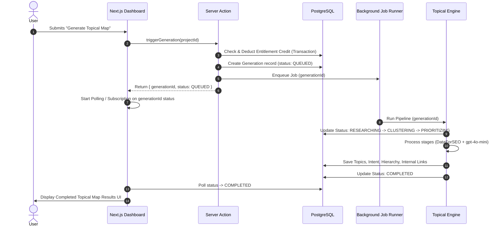

# DOC-04: System Architecture Document

**Status**: Draft (Under Review)  
**Created**: 2026-08-31  
**Blocks**: DOC-05 (DB), DOC-06 (API), DOC-07 (Auth)  
**Last Updated**: 2026-08-31  

---

## 1. Executive Summary

This document specifies the technical architecture for the **Topical Authority Creator MVP**.

Key constraints from [PROJECT_CONTEXT.md](file:///d:/Gravity%20Projects/topical-map-creator/docs/PROJECT_CONTEXT.md):
- **Monolith over microservices**: Everything lives in a single Next.js TypeScript repository (§22 & §44).
- **Asynchronous generation**: Long-running engine pipelines run asynchronously without blocking web HTTP requests (§19 & §22).
- **Server-side enforcement**: Entitlements, rate limits, API keys, cost budgets, and ownership validation must be enforced on the backend (§25 & §26).
- **Anti-AI-Slop UX**: Clean, professional software interface (§3).

---

## 2. System Architecture Diagram

```mermaid
graph TD
    subgraph Client Layer
        Browser[User Browser / Next.js SPA]
    end

    subgraph Edge & Routing Layer (Vercel)
        Middleware[Next.js Middleware<br/>Auth & Rate Limiting]
        ServerActions[Next.js Server Actions<br/>Mutations & Auth Checks]
        APIRoutes[Next.js API Routes<br/>Webhooks & Exports]
    end

    subgraph Application & Engine Core
        EntitlementService[Entitlement & Credit Service]
        GenerationOrchestrator[Generation Orchestrator]
        EnginePipeline[Topical Authority Engine Pipeline]
    end

    subgraph Data & Provider Integration
        ResearchProvider[DataForSEO Provider API]
        AIRouter[AI Model Router<br/>OpenAI gpt-4o-mini & embeddings]
        CacheLayer[Research Cache Service]
    end

    subgraph Database & Persistence (Supabase)
        DB[(PostgreSQL Database)]
        Storage[(Object Storage<br/>PDF/CSV exports)]
        AuthService[(Supabase Auth)]
    end

    Browser -->|HTTPS / Next.js App Router| Middleware
    Middleware --> ServerActions
    Middleware --> APIRoutes
    ServerActions --> EntitlementService
    ServerActions --> GenerationOrchestrator
    GenerationOrchestrator --> EnginePipeline
    EnginePipeline --> ResearchProvider
    EnginePipeline --> AIRouter
    EnginePipeline --> CacheLayer
    CacheLayer <--> DB
    EntitlementService <--> DB
    APIRoutes <--> Storage
    Browser <--> AuthService
```

---

## 3. Technology Stack Specification

| Tier | Component | Technology | Rationale |
|------|-----------|------------|-----------|
| **Frontend Framework** | Web Application | **Next.js 14+ (App Router)** | Full-stack TypeScript, SSR/RSC for fast dashboard render |
| **Language** | Type Safety | **TypeScript (Strict Mode)** | End-to-end type safety across DB schemas, API contracts, and UI components |
| **Styling & Components** | UI System | **Tailwind CSS + shadcn/ui** | Professional, accessible, utility-first UI adhering to §3 anti-slop rules |
| **Database & Auth** | Persistence & Auth | **Supabase (PostgreSQL + RLS)** | Managed Postgres, built-in Auth, Row-Level Security, fast development |
| **Background Jobs** | Async Generation | **Inngest / Trigger.dev** or **Supabase Edge Functions + Queue** | Reliably handles 1-5 minute async engine pipeline jobs with automatic retries |
| **Object Storage** | Artifact Storage | **Supabase Storage** (or Cloudflare R2) | Stores exported PDF/CSV files without bloating database rows (§22) |
| **Payment Gateway** | Billing | **Razorpay India** | Standard gateway for India market (§1, launch at ₹199) |
| **Deployment** | Infrastructure | **Vercel** | Automated deployments, edge middleware, serverless functions |

---

## 4. Module Boundaries & Folder Structure

To ensure clean architecture without microservices:

```
src/
├── app/                      # Next.js App Router (Pages & Routes)
│   ├── (auth)/               # Login, Signup, Auth Callbacks
│   ├── (dashboard)/          # Dashboard, Projects, Create Map, Settings
│   ├── (marketing)/          # Landing page, Legal pages
│   └── api/                  # API routes (webhooks, exports, background triggers)
├── components/               # UI components
│   ├── ui/                   # Primitive shadcn components (button, dialog, table)
│   ├── layout/               # Sidebar, Header, Nav
│   ├── dashboard/            # Overview cards, Project lists
│   └── results/              # Topical map views (Topics, Clusters, Intent, Link Graph)
├── lib/                      # Core Business Logic & Engine
│   ├── engine/               # THE TOPICAL AUTHORITY ENGINE (Core IP)
│   │   ├── pipeline.ts       # Main orchestrator (16 stages)
│   │   ├── stages/           # Individual stage modules (01-topic-understanding... 14-validation)
│   │   ├── providers/        # Research provider interfaces (DataForSEO implementation)
│   │   ├── ai/               # AI Model Router (OpenAI gpt-4o-mini client)
│   │   └── scoring/          # Priority scoring framework
│   ├── services/             # Application Services
│   │   ├── entitlement.ts    # Credit checking & deduction logic
│   │   ├── payment.ts        # Razorpay webhook & verification
│   │   ├── cache.ts          # Research cache manager
│   │   └── export.ts         # CSV & PDF generation service
│   ├── db/                   # Database client & Supabase helpers
│   └── validation/           # Zod schemas for API inputs & LLM outputs
├── types/                    # Shared TypeScript interfaces & DB types
```

---

## 5. Asynchronous Generation Flow

Generation takes ~1–4 minutes. The client must never wait on an open HTTP connection.



---

## 6. Security, Authorization & Entitlements

1. **Authentication**: Managed by Supabase Auth (JWT in secure HTTP-only cookies).
2. **Server Authorization**: Every API route and Server Action checks:
   - Valid session user ID
   - Project ownership check (`WHERE user_id = current_user_id`)
   - Entitlement balance check (`credits_remaining > 0` for paid generations)
3. **Database Row Level Security (RLS)**: Enforced on PostgreSQL tables. Users can only SELECT/UPDATE/DELETE rows matching `auth.uid() = user_id`.
4. **Secret Protection**: API Keys (`DATAFORSEO_API_KEY`, `OPENAI_API_KEY`, `RAZORPAY_SECRET`) are stored purely in server environment variables and never bundled into client JS.

---

## 7. Data Storage & Caching Strategy

1. **Relational Data**: Stored in PostgreSQL (`projects`, `generations`, `topics`, `internal_links`, `entitlements`, `payments`).
2. **Research Cache**: `research_cache` table caches raw search query results by `(query_hash, country, language)` for 30 days. Multiple user projects for similar keywords reuse cached search data, eliminating redundant DataForSEO costs.
3. **Artifact Storage**: Exported PDFs and CSVs are rendered on-demand or saved to Supabase Storage with signed download URLs.

---

## 8. Development & Deployment Environments

- **Development**: Local Next.js dev server, Supabase Local CLI / Staging DB, OpenAI sandbox key.
- **Staging**: Vercel Preview Deployments, Supabase Staging Project.
- **Production**: Vercel Production Deployment, Supabase Production Postgres DB, Razorpay Live Webhooks.
