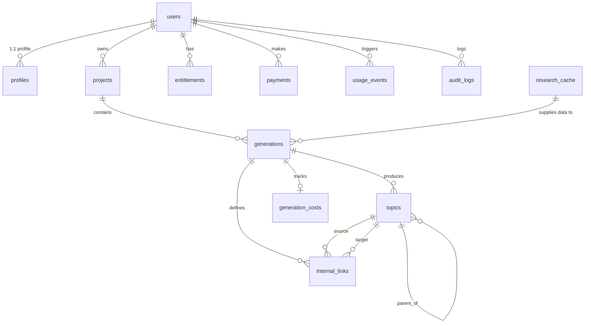

# DOC-05: Database Schema & RLS Policies

**Status**: Draft (Under Review)  
**Created**: 2026-08-31  
**Blocks**: Phase 2 Specs (DOC-08, DOC-11) & Phase 3 Specs (DOC-13)  
**Last Updated**: 2026-08-31  

---

## 1. Executive Summary

This document specifies the exact PostgreSQL database schema, custom ENUM types, constraints, indices, foreign keys, entity relationships, and **Row-Level Security (RLS) policies** for the Topical Authority Creator MVP.

It implements the 11 database entities defined in [PROJECT_CONTEXT.md §24](file:///d:/Gravity%20Projects/topical-map-creator/docs/PROJECT_CONTEXT.md) and enforces server-side security & data isolation rules (§25 & §26).

---

## 2. Entity Relationship Diagram



---

## 3. Database Custom ENUM Types

```sql
-- Plan Tier
CREATE TYPE plan_tier_enum AS ENUM ('free', 'paid_early_access', 'admin');

-- Generation Status State Machine (per PROJECT_CONTEXT §19)
CREATE TYPE generation_status_enum AS ENUM (
    'QUEUED',
    'RESEARCHING',
    'EXPANDING_TOPICS',
    'CLUSTERING',
    'ANALYZING_INTENT',
    'PRIORITIZING',
    'BUILDING_MAP',
    'COMPLETED',
    'FAILED'
);

-- Search Intent Categories (per §14)
CREATE TYPE search_intent_enum AS ENUM (
    'INFORMATIONAL',
    'COMMERCIAL',
    'TRANSACTIONAL',
    'NAVIGATIONAL',
    'UNKNOWN'
);

-- Topic Priority Categories (per §15)
CREATE TYPE topic_priority_enum AS ENUM (
    'HIGH',
    'MEDIUM',
    'LOW'
);

-- Internal Link Relationship Types (per §16)
CREATE TYPE link_relationship_type_enum AS ENUM (
    'PARENT_CHILD',
    'RELATED_TOPIC',
    'SUPPORTING_TO_PILLAR'
);

-- Payment Provider Status
CREATE TYPE payment_status_enum AS ENUM (
    'PENDING',
    'SUCCESS',
    'FAILED',
    'REFUNDED'
);
```

---

## 4. Complete DDL & Table Specifications

```sql
-- Enable UUID extension
CREATE EXTENSION IF NOT EXISTS "uuid-ossp";

-- 1. Profiles Table (1:1 with auth.users)
CREATE TABLE profiles (
    id UUID PRIMARY KEY DEFAULT uuid_generate_v4(),
    user_id UUID NOT NULL UNIQUE REFERENCES auth.users(id) ON DELETE CASCADE,
    full_name TEXT,
    created_at TIMESTAMPTZ NOT NULL DEFAULT NOW(),
    updated_at TIMESTAMPTZ NOT NULL DEFAULT NOW()
);

-- 2. Projects Table
CREATE TABLE projects (
    id UUID PRIMARY KEY DEFAULT uuid_generate_v4(),
    user_id UUID NOT NULL REFERENCES auth.users(id) ON DELETE CASCADE,
    name TEXT NOT NULL CHECK (char_length(name) >= 2 AND char_length(name) <= 100),
    primary_topic TEXT NOT NULL CHECK (char_length(primary_topic) >= 2 AND char_length(primary_topic) <= 150),
    website_url TEXT CHECK (website_url IS NULL OR website_url ~* '^https?://.*'),
    country VARCHAR(10) NOT NULL DEFAULT 'IN',
    language VARCHAR(10) NOT NULL DEFAULT 'en',
    created_at TIMESTAMPTZ NOT NULL DEFAULT NOW(),
    updated_at TIMESTAMPTZ NOT NULL DEFAULT NOW(),
    deleted_at TIMESTAMPTZ DEFAULT NULL
);

-- 3. Generations Table
CREATE TABLE generations (
    id UUID PRIMARY KEY DEFAULT uuid_generate_v4(),
    project_id UUID NOT NULL REFERENCES projects(id) ON DELETE CASCADE,
    user_id UUID NOT NULL REFERENCES auth.users(id) ON DELETE CASCADE,
    status generation_status_enum NOT NULL DEFAULT 'QUEUED',
    credit_cost INT NOT NULL DEFAULT 1 CHECK (credit_cost >= 0),
    model_usage JSONB DEFAULT '{}'::jsonb,
    estimated_cost_inr NUMERIC(10, 4) DEFAULT 0.0000,
    started_at TIMESTAMPTZ DEFAULT NULL,
    completed_at TIMESTAMPTZ DEFAULT NULL,
    error_code TEXT DEFAULT NULL,
    error_message TEXT DEFAULT NULL,
    created_at TIMESTAMPTZ NOT NULL DEFAULT NOW()
);

-- 4. Topics Table
CREATE TABLE topics (
    id UUID PRIMARY KEY DEFAULT uuid_generate_v4(),
    generation_id UUID NOT NULL REFERENCES generations(id) ON DELETE CASCADE,
    parent_topic_id UUID REFERENCES topics(id) ON DELETE SET NULL,
    topic TEXT NOT NULL CHECK (char_length(topic) >= 2 AND char_length(topic) <= 200),
    cluster TEXT NOT NULL DEFAULT 'General',
    intent search_intent_enum NOT NULL DEFAULT 'INFORMATIONAL',
    priority topic_priority_enum NOT NULL DEFAULT 'MEDIUM',
    position INT NOT NULL DEFAULT 0,
    created_at TIMESTAMPTZ NOT NULL DEFAULT NOW()
);

-- 5. Internal Links Table
CREATE TABLE internal_links (
    id UUID PRIMARY KEY DEFAULT uuid_generate_v4(),
    generation_id UUID NOT NULL REFERENCES generations(id) ON DELETE CASCADE,
    source_topic_id UUID NOT NULL REFERENCES topics(id) ON DELETE CASCADE,
    target_topic_id UUID NOT NULL REFERENCES topics(id) ON DELETE CASCADE,
    relationship_type link_relationship_type_enum NOT NULL DEFAULT 'RELATED_TOPIC',
    created_at TIMESTAMPTZ NOT NULL DEFAULT NOW(),
    CONSTRAINT chk_no_self_link CHECK (source_topic_id <> target_topic_id)
);

-- 6. Entitlements Table
CREATE TABLE entitlements (
    id UUID PRIMARY KEY DEFAULT uuid_generate_v4(),
    user_id UUID NOT NULL UNIQUE REFERENCES auth.users(id) ON DELETE CASCADE,
    plan plan_tier_enum NOT NULL DEFAULT 'free',
    credits_total INT NOT NULL DEFAULT 1 CHECK (credits_total >= 0),
    credits_used INT NOT NULL DEFAULT 0 CHECK (credits_used >= 0),
    expires_at TIMESTAMPTZ DEFAULT NULL,
    created_at TIMESTAMPTZ NOT NULL DEFAULT NOW(),
    updated_at TIMESTAMPTZ NOT NULL DEFAULT NOW(),
    CONSTRAINT chk_credits_check CHECK (credits_used <= credits_total)
);

-- 7. Payments Table
CREATE TABLE payments (
    id UUID PRIMARY KEY DEFAULT uuid_generate_v4(),
    user_id UUID NOT NULL REFERENCES auth.users(id) ON DELETE CASCADE,
    provider TEXT NOT NULL DEFAULT 'razorpay',
    provider_payment_id TEXT NOT NULL UNIQUE,
    provider_order_id TEXT UNIQUE,
    amount_inr NUMERIC(10, 2) NOT NULL CHECK (amount_inr >= 0),
    currency VARCHAR(5) NOT NULL DEFAULT 'INR',
    status payment_status_enum NOT NULL DEFAULT 'PENDING',
    created_at TIMESTAMPTZ NOT NULL DEFAULT NOW()
);

-- 8. Usage Events Table
CREATE TABLE usage_events (
    id UUID PRIMARY KEY DEFAULT uuid_generate_v4(),
    user_id UUID REFERENCES auth.users(id) ON DELETE SET NULL,
    event_type TEXT NOT NULL,
    resource_id UUID DEFAULT NULL,
    metadata JSONB DEFAULT '{}'::jsonb,
    created_at TIMESTAMPTZ NOT NULL DEFAULT NOW()
);

-- 9. Audit Logs Table
CREATE TABLE audit_logs (
    id UUID PRIMARY KEY DEFAULT uuid_generate_v4(),
    user_id UUID REFERENCES auth.users(id) ON DELETE SET NULL,
    event_type TEXT NOT NULL,
    ip_address TEXT DEFAULT NULL,
    user_agent TEXT DEFAULT NULL,
    metadata JSONB DEFAULT '{}'::jsonb,
    created_at TIMESTAMPTZ NOT NULL DEFAULT NOW()
);

-- 10. Research Cache Table (Shared SERP/Keyword Cache - NO User Private Data)
CREATE TABLE research_cache (
    id UUID PRIMARY KEY DEFAULT uuid_generate_v4(),
    cache_key TEXT NOT NULL UNIQUE, -- SHA256 of (query + country + language + provider)
    query TEXT NOT NULL,
    country VARCHAR(10) NOT NULL DEFAULT 'IN',
    language VARCHAR(10) NOT NULL DEFAULT 'en',
    provider TEXT NOT NULL DEFAULT 'dataforseo',
    data JSONB NOT NULL,
    data_hash TEXT NOT NULL,
    created_at TIMESTAMPTZ NOT NULL DEFAULT NOW(),
    expires_at TIMESTAMPTZ NOT NULL DEFAULT (NOW() + INTERVAL '30 days')
);

-- 11. Generation Costs Table (Economics & Cost Guardrails)
CREATE TABLE generation_costs (
    id UUID PRIMARY KEY DEFAULT uuid_generate_v4(),
    generation_id UUID NOT NULL UNIQUE REFERENCES generations(id) ON DELETE CASCADE,
    ai_cost_inr NUMERIC(10, 4) NOT NULL DEFAULT 0.0000,
    search_cost_inr NUMERIC(10, 4) NOT NULL DEFAULT 0.0000,
    infrastructure_cost_inr NUMERIC(10, 4) NOT NULL DEFAULT 0.0000,
    total_cost_inr NUMERIC(10, 4) NOT NULL DEFAULT 0.0000,
    input_tokens INT NOT NULL DEFAULT 0,
    output_tokens INT NOT NULL DEFAULT 0,
    external_requests INT NOT NULL DEFAULT 0,
    created_at TIMESTAMPTZ NOT NULL DEFAULT NOW()
);
```

---

## 5. Performance Indices

```sql
-- Projects
CREATE INDEX idx_projects_user_id ON projects(user_id) WHERE deleted_at IS NULL;

-- Generations
CREATE INDEX idx_generations_project_id ON generations(project_id);
CREATE INDEX idx_generations_user_id ON generations(user_id);
CREATE INDEX idx_generations_status ON generations(status);

-- Topics
CREATE INDEX idx_topics_generation_id ON topics(generation_id);
CREATE INDEX idx_topics_parent_id ON topics(parent_topic_id);
CREATE INDEX idx_topics_cluster ON topics(generation_id, cluster);

-- Internal Links
CREATE INDEX idx_links_generation_id ON internal_links(generation_id);
CREATE INDEX idx_links_source_target ON internal_links(source_topic_id, target_topic_id);

-- Research Cache
CREATE INDEX idx_cache_key ON research_cache(cache_key);
CREATE INDEX idx_cache_expires ON research_cache(expires_at);
```

---

## 6. Row-Level Security (RLS) Policies

Every user-owned table has strict server-enforced RLS enabled.

```sql
-- Enable RLS on all user tables
ALTER TABLE profiles ENABLE ROW LEVEL SECURITY;
ALTER TABLE projects ENABLE ROW LEVEL SECURITY;
ALTER TABLE generations ENABLE ROW LEVEL SECURITY;
ALTER TABLE topics ENABLE ROW LEVEL SECURITY;
ALTER TABLE internal_links ENABLE ROW LEVEL SECURITY;
ALTER TABLE entitlements ENABLE ROW LEVEL SECURITY;
ALTER TABLE payments ENABLE ROW LEVEL SECURITY;
ALTER TABLE generation_costs ENABLE ROW LEVEL SECURITY;

-- 1. Profiles Policy
CREATE POLICY profiles_user_policy ON profiles
    FOR ALL USING (auth.uid() = user_id);

-- 2. Projects Policy
CREATE POLICY projects_user_policy ON projects
    FOR ALL USING (auth.uid() = user_id AND deleted_at IS NULL);

-- 3. Generations Policy
CREATE POLICY generations_user_policy ON generations
    FOR ALL USING (auth.uid() = user_id);

-- 4. Topics Policy (Accessible through owning generation's user)
CREATE POLICY topics_user_policy ON topics
    FOR ALL USING (
        EXISTS (
            SELECT 1 FROM generations
            WHERE generations.id = topics.generation_id
            AND generations.user_id = auth.uid()
        )
    );

-- 5. Internal Links Policy
CREATE POLICY internal_links_user_policy ON internal_links
    FOR ALL USING (
        EXISTS (
            SELECT 1 FROM generations
            WHERE generations.id = internal_links.generation_id
            AND generations.user_id = auth.uid()
        )
    );

-- 6. Entitlements Policy (Read-only for user; mutations done via service-role / triggers)
CREATE POLICY entitlements_select_policy ON entitlements
    FOR SELECT USING (auth.uid() = user_id);

-- 7. Payments Policy (Read-only for user)
CREATE POLICY payments_select_policy ON payments
    FOR SELECT USING (auth.uid() = user_id);

-- 8. Generation Costs Policy (Read-only for owning user)
CREATE POLICY generation_costs_select_policy ON generation_costs
    FOR SELECT USING (
        EXISTS (
            SELECT 1 FROM generations
            WHERE generations.id = generation_costs.generation_id
            AND generations.user_id = auth.uid()
        )
    );
```
