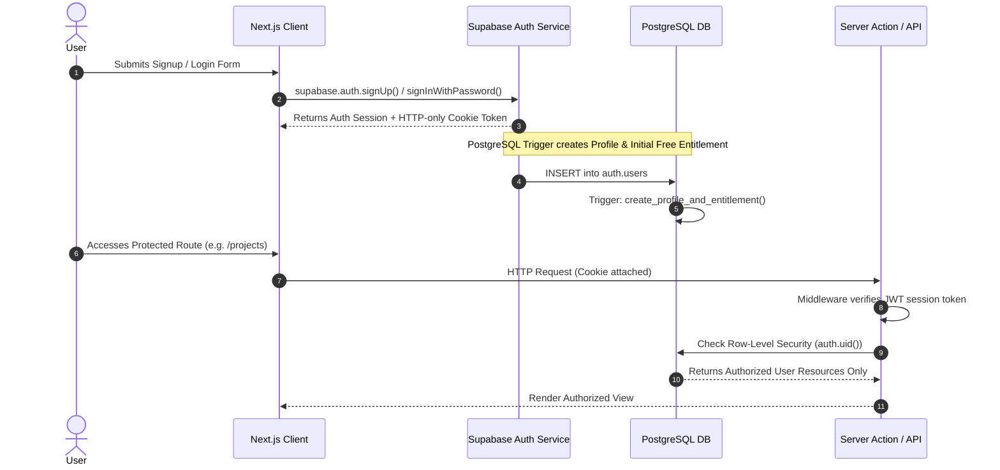

# DOC-07: Authentication & Authorization Spec

**Status**: Draft (Under Review)  
**Created**: 2026-08-31  
**Blocks**: Phase 2 Specs (DOC-08) & Phase 3 Specs (DOC-12)  
**Last Updated**: 2026-08-31  

---

## 1. Executive Summary

This document specifies the authentication architecture and authorization controls for the Topical Authority Creator MVP.

Key security requirements from [PROJECT_CONTEXT.md §26 & §28](file:///d:/Gravity%20Projects/topical-map-creator/docs/PROJECT_CONTEXT.md):
- **Managed Authentication**: Use Supabase Auth (do not build custom password storage).
- **Server Authorization**: Validate authentication, resource ownership, and entitlement credits on every server request.
- **Client Security**: Do not trust client-side state, local storage credits, or payment status.

---

## 2. Authentication Architecture (Supabase Auth)



---

## 3. Supported Authentication Providers

1. **Email & Password**:
   - Minimum 8 characters.
   - Email verification required before starting generation.
   - Password reset via Supabase magic link email.
2. **Google OAuth (Optional MVP)**:
   - One-click sign-in via Google OAuth 2.0.
   - Automatically sets `email_confirmed_at`.

---

## 4. Automatic Profile & Free Entitlement Trigger

When a user signs up, PostgreSQL automatically initializes their `profiles` row and `entitlements` row (1 free generation credit) via a database trigger:

```sql
CREATE OR REPLACE FUNCTION public.handle_new_user_signup()
RETURNS TRIGGER AS $$
BEGIN
    -- 1. Create Profile Row
    INSERT INTO public.profiles (user_id, full_name)
    VALUES (
        NEW.id,
        COALESCE(NEW.raw_user_meta_data->>'full_name', SPLIT_PART(NEW.email, '@', 1))
    );

    -- 2. Create Initial Free Entitlement (1 Credit)
    INSERT INTO public.entitlements (user_id, plan, credits_total, credits_used)
    VALUES (
        NEW.id,
        'free',
        1,  -- 1 initial free generation entitlement (§5)
        0
    );

    RETURN NEW;
END;
$$ LANGUAGE plpgsql SECURITY DEFINER;

-- Attach trigger to auth.users
CREATE TRIGGER on_auth_user_created
    AFTER INSERT ON auth.users
    FOR EACH ROW EXECUTE FUNCTION public.handle_new_user_signup();
```

---

## 5. Server-Side Authorization Middleware & Entitlement Check

### 5.1 Route Protection Matrix

| Route Path | Auth Requirement | Entitlement Requirement | Action on Failure |
|------------|------------------|-------------------------|-------------------|
| `/` | Public | None | N/A |
| `/login`, `/signup` | Guest Only | None | Redirect to `/dashboard` if logged in |
| `/dashboard` | Authenticated | None | Redirect to `/login` |
| `/projects/*` | Authenticated | Resource Ownership | 404 / 403 Forbidden |
| `/create` | Authenticated | None | Redirect to `/login` |
| **API `POST /api/generations`** | Authenticated | `credits_remaining > 0` | `402 Payment Required` (Prompt Upgrade) |
| **API `GET /api/exports/*`** | Authenticated | `plan == 'paid_early_access'` | `403 Forbidden` (Paid Feature Only) |

### 5.2 Entitlement Enforcement Helper (`lib/services/entitlement.ts`)

```typescript
import { createServerClient } from '@/lib/db/supabase-server';

export interface EntitlementCheckResult {
  allowed: boolean;
  reason?: 'NOT_AUTHENTICATED' | 'EMAIL_NOT_VERIFIED' | 'NO_CREDITS_REMAINING' | 'FEATURE_PAID_ONLY';
  creditsRemaining: number;
  plan: 'free' | 'paid_early_access' | 'admin';
}

export async function checkGenerationEntitlement(userId: string): Promise<EntitlementCheckResult> {
  const supabase = createServerClient();

  const { data: entitlement, error } = await supabase
    .from('entitlements')
    .select('plan, credits_total, credits_used')
    .eq('user_id', userId)
    .single();

  if (error || !entitlement) {
    return { allowed: false, reason: 'NOT_AUTHENTICATED', creditsRemaining: 0, plan: 'free' };
  }

  const creditsRemaining = entitlement.credits_total - entitlement.credits_used;

  if (creditsRemaining <= 0) {
    return {
      allowed: false,
      reason: 'NO_CREDITS_REMAINING',
      creditsRemaining: 0,
      plan: entitlement.plan,
    };
  }

  return {
    allowed: true,
    creditsRemaining,
    plan: entitlement.plan,
  };
}
```

---

## 6. Security Principles Checklist Compliance

- ✅ **No Client Credits**: Client components query server actions; credits are checked and decremented strictly in PostgreSQL database transactions.
- ✅ **No Password Storage**: Managed entirely by Supabase Auth with bcrypt hashing and rate-limited auth endpoints.
- ✅ **RLS Server Isolation**: Users cannot read/write other users' projects or topical maps even if they guess UUIDs.
- ✅ **Session Invalidation**: Logging out invalidates the HTTP-only cookie on Vercel Edge middleware.
