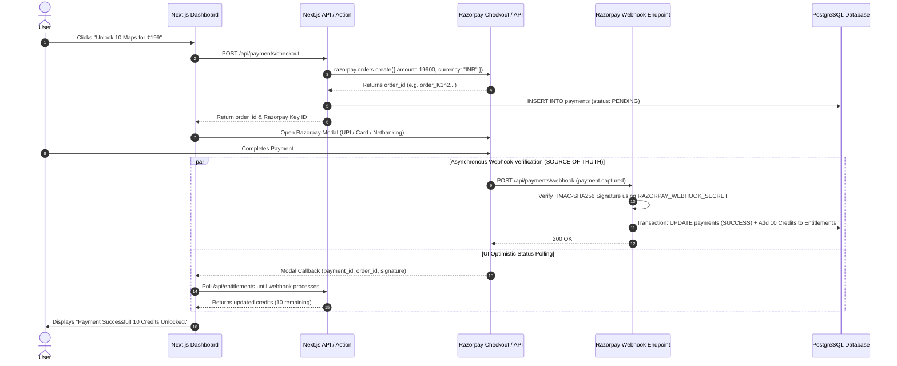
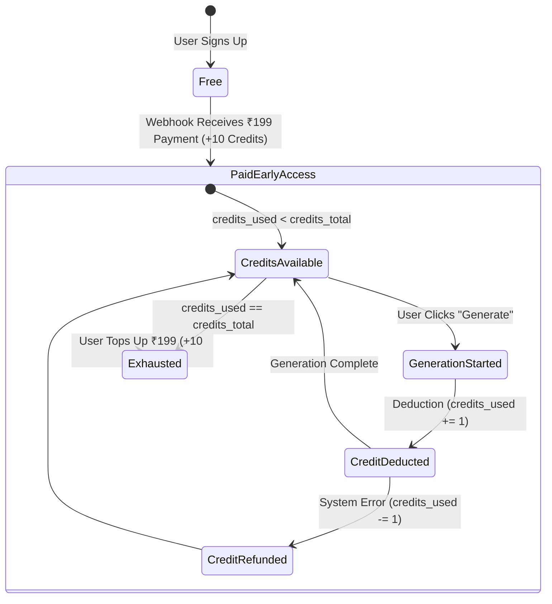

# DOC-13: Payment & Entitlement Spec

**Status**: Draft (Under Review)  
**Created**: 2026-08-31  
**Blocks**: Phase 4 Specs & Payment Integration Coding  
**Last Updated**: 2026-08-31  

---

## 1. Executive Summary

This document specifies the payment architecture, Razorpay integration, webhook verification, and entitlement state machine for the Topical Authority Creator MVP.

Per [PROJECT_CONTEXT.md §4 & §30 (Payment Architecture)](file:///d:/Gravity%20Projects/topical-map-creator/docs/PROJECT_CONTEXT.md):
- **NON-NEGOTIABLE**: The browser's payment success response must NEVER independently grant paid access.
- Only verified server-side payment webhook events (`payment.captured`) can modify entitlement records.

---

## 2. Payment & Entitlement Architecture Diagram



---

## 3. Entitlement State Machine



---

## 4. Webhook Handler Implementation (`app/api/payments/webhook/route.ts`)

```typescript
import { NextResponse } from 'next/server';
import crypto from 'crypto';
import { createAdminServerClient } from '@/lib/db/supabase-server';

export async function POST(req: Request) {
  const bodyText = await req.text();
  const signature = req.headers.get('x-razorpay-signature');

  if (!signature) {
    return NextResponse.json({ error: 'Missing signature' }, { status: 400 });
  }

  // 1. Verify HMAC Signature
  const expectedSignature = crypto
    .createHmac('sha256', process.env.RAZORPAY_WEBHOOK_SECRET!)
    .update(bodyText)
    .digest('hex');

  if (expectedSignature !== signature) {
    return NextResponse.json({ error: 'Invalid webhook signature' }, { status: 401 });
  }

  const event = JSON.parse(bodyText);

  // 2. Handle payment.captured event
  if (event.event === 'payment.captured') {
    const payment = event.payload.payment.entity;
    const orderId = payment.order_id;
    const paymentId = payment.id;
    const amountInr = payment.amount / 100; // Razorpay amounts are in paise

    const supabase = createAdminServerClient();

    // 3. Find payment record and user_id
    const { data: dbPayment, error: findError } = await supabase
      .from('payments')
      .select('user_id, status')
      .eq('provider_order_id', orderId)
      .single();

    if (findError || !dbPayment) {
      return NextResponse.json({ error: 'Payment order not found' }, { status: 404 });
    }

    if (dbPayment.status === 'SUCCESS') {
      return NextResponse.json({ status: 'Already processed' }, { status: 200 });
    }

    // 4. Transactionally Update Payment & Entitlement
    const { error: txError } = await supabase.rpc('grant_paid_entitlement', {
      p_user_id: dbPayment.user_id,
      p_payment_id: paymentId,
      p_order_id: orderId,
      p_amount_inr: amountInr,
      p_credits_to_add: 10,
    });

    if (txError) {
      console.error('Failed to grant entitlement:', txError);
      return NextResponse.json({ error: 'Entitlement grant failed' }, { status: 500 });
    }
  }

  return NextResponse.json({ status: 'ok' }, { status: 200 });
}
```

---

## 5. PostgreSQL Entitlement Grant Stored Procedure

```sql
CREATE OR REPLACE FUNCTION grant_paid_entitlement(
    p_user_id UUID,
    p_payment_id TEXT,
    p_order_id TEXT,
    p_amount_inr NUMERIC,
    p_credits_to_add INT
) RETURNS VOID AS $$
BEGIN
    -- 1. Update Payment Status
    UPDATE payments
    SET status = 'SUCCESS',
        provider_payment_id = p_payment_id
    WHERE provider_order_id = p_order_id;

    -- 2. Grant Credits & Upgrade Plan
    INSERT INTO entitlements (user_id, plan, credits_total, credits_used)
    VALUES (p_user_id, 'paid_early_access', p_credits_to_add, 0)
    ON CONFLICT (user_id) DO UPDATE
    SET plan = 'paid_early_access',
        credits_total = entitlements.credits_total + p_credits_to_add,
        updated_at = NOW();

    -- 3. Log Audit Event
    INSERT INTO audit_logs (user_id, event_type, metadata)
    VALUES (
        p_user_id,
        'PAYMENT_SUCCESS_CREDITS_GRANTED',
        jsonb_build_object(
            'amount_inr', p_amount_inr,
            'credits_added', p_credits_to_add,
            'payment_id', p_payment_id
        )
    );
END;
$$ LANGUAGE plpgsql SECURITY DEFINER;
```
