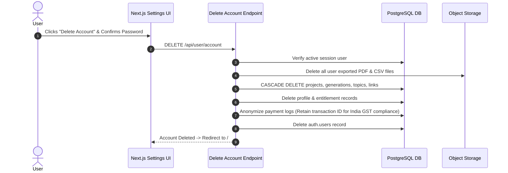

# DOC-16: Legal Documents Spec

**Status**: Draft (Under Review)  
**Created**: 2026-08-31  
**Blocks**: Production Public Launch  
**Last Updated**: 2026-08-31  

---

## 1. Executive Summary

This document specifies the legal structures, privacy disclosures, third-party data processing declarations, refund policies, and account/data deletion compliance workflows for the Topical Authority Creator MVP.

Per [PROJECT_CONTEXT.md §32, §33, & §37](file:///d:/Gravity%20Projects/topical-map-creator/docs/PROJECT_CONTEXT.md):
- **Privacy Principles**: Collect minimum necessary data, do not sell user data, do NOT use customer projects to train AI models by default.
- **Account Deletion**: Full self-service deletion workflow (`Settings -> Delete Account`) with explicit tax/accounting retention exceptions.

---

## 2. Privacy Policy Outlines & Disclosures (§33)

### Core Commitments
1. **No AI Training**: Customer project inputs, primary topics, and generated topical maps are NEVER sent to public LLM training datasets.
2. **Third-Party Sub-Processors Disclosed**:
   - **OpenAI**: AI reasoning and embedding vector generation.
   - **DataForSEO**: External Google SERP & keyword data expansion.
   - **Supabase (AWS/GCP)**: Database hosting, authentication, and file storage.
   - **Razorpay India**: Payment processing and webhook transaction settlement.
   - **Vercel**: Edge application hosting and serverless functions.
3. **Private Research Isolation**: User project data is kept strictly isolated from the shared public research cache table (`research_cache`). One user's project data is never visible or exposed to another user (§10 & §33).

---

## 3. Terms of Service Outlines (§37)

- **Early Access Entitlement**: ₹199 launch fee grants a fixed entitlement of **10 Generation Credits** for personal or commercial project use (§4).
- **Usage Restrictions**: No API scraping, automated bot generation, multi-account free plan abuse, or reverse engineering of the engine (§28).
- **Service Availability**: Best-effort SLA during early access beta; failed generations caused by infrastructure errors automatically credit back 1 generation (§31).

---

## 4. Refund Policy Outlines (§31 & §37)

- **System Failures**: If a generation fails due to server error, timeout, or external provider outage, the consumed credit is **automatically refunded to the account balance** in real time.
- **Paid Entitlement Refunds**: Customers may request a full ₹199 monetary refund within 7 days of purchase if 0 credits have been consumed. Once generation credits are used, monetary refunds are non-standard except for verified payment processing errors.

---

## 5. Account & Data Deletion Workflow (§32)

When a user initiates `Settings -> Delete Account`:



### PostgreSQL Account Cascade Deletion Function

```sql
CREATE OR REPLACE FUNCTION delete_user_account_data(p_user_id UUID)
RETURNS VOID AS $$
BEGIN
    -- 1. Delete user files from storage metadata (handled via storage API)
    
    -- 2. Cascade delete database entities
    DELETE FROM projects WHERE user_id = p_user_id;
    DELETE FROM generations WHERE user_id = p_user_id;
    DELETE FROM entitlements WHERE user_id = p_user_id;
    DELETE FROM profiles WHERE user_id = p_user_id;
    
    -- 3. Anonymize payment logs for tax/accounting retention compliance (§32)
    UPDATE payments 
    SET user_id = NULL
    WHERE user_id = p_user_id;

    -- 4. Delete auth user record
    DELETE FROM auth.users WHERE id = p_user_id;
END;
$$ LANGUAGE plpgsql SECURITY DEFINER;
```
